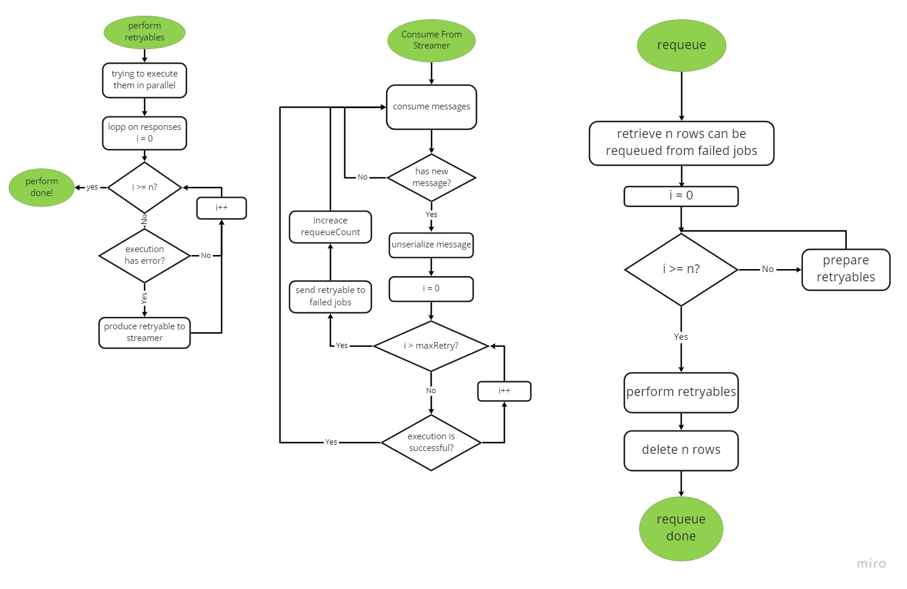

# preview
* This package is for doing jobs with high reliability
# installation
## install package
run `composer require daalvand/retry-policy`

### publish provider

#### Laravel
* `php artisan vendor:publish --provider="Daalvand\RetryPolicy\RetryPolicyServiceProvider"`

#### Lumen
* Add the service provider to `bootstrap/app.php` file:
```php
<?php
//...
/** @var App $app */
$app->register(Daalvand\RetryPolicy\RetryPolicyServiceProvider::class);
```

Copy the config files from `/vendor/daalvand/retry-policy/src/config` to `config` directory. Then configure it in  `/bootstrap/app.php`
file:
```php
<?php
/** @var App $app */
$app->configure("retry-policy");
```
### run `php artisan migrate` to migrate failed jobs table

# Usage

## Example
* extends your retryable from `Retryable abstract`:
```php
<?php
use \Daalvand\RetryPolicy\Contracts\Retryable;
//Custom Class
class CustomRetryable extends Retryable
{
    public function execute() : bool
    {
        // TODO: Implement execute() method.
    }
}

#### Create an object from custom retryable
use Daalvand\RetryPolicy\Facades\RetryContext;
$retryable = new CustomRetryable();
$retryable
->setMaxRequeue(20)
->setMaxRetry(2)
->setRetryDelay(10)
->setRqueueDelay(3600);

//retry retryables
RetryContext::perform([$retryable]);
```
#### for consume failed retryables to streamer run following Command:

`retry_policy:consumer`

#### for requeue from failed jobs table add following command in `kernel.php` or `os crontab`

`retry_policy:requeue`

`

# activity diagram 




